 

---

### `// SYSTEMS I BUILD`

I work on the layer most AI tooling skips — **state, execution order and failure**.
Agents that plan multi-step work, call real tools, and survive being interrupted
halfway through.

Currently building **WRATH**, an AI-powered engineering operating system, and taking
system design and distributed systems apart properly rather than reading summaries
of them.

I care about problems where correctness is hard to fake: retries, partial failure,
long-running state, and making a model's output something you can actually depend on.

 

---

## 🧭 Current Focus

<table>
<tr>
<td width="25%" valign="top" align="center">

**🔨 Building**

AI & Agentic
Engineering Workflows

</td>
<td width="25%" valign="top" align="center">

**📐 Learning**

System Design
Distributed Systems

</td>
<td width="25%" valign="top" align="center">

**⚡ Practicing**

DSA · Java
Problem Solving

</td>
<td width="25%" valign="top" align="center">

**🔭 Exploring**

AI-native developer
tooling

</td>
</tr>
</table>

---

## ⚔️ WRATH — AI-Powered Engineering Operating System

> *An AI-native engineering platform that brings agentic workflows and core
> software-engineering capabilities into a single developer experience.*
> **Private repository · in active development**

**The problem.** Most AI developer tools stop at autocomplete. They're good at
producing a block of code and bad at everything around it — holding context across a
multi-step task, calling real tools, knowing what already ran, and recovering when
something fails halfway.

**What I'm building.** The layer above autocomplete: agents that plan a multi-step
task, invoke real tools, carry state across long-running work, and can be stopped and
resumed without losing their place. The engineering problem isn't prompting — it's
state, execution order, and failure.

**Architecture**

| Layer | What it does |
|---|---|
| 🧠 **Agent runtime** | Specialised agents, each with a scoped set of tools and skills |
| 🗺️ **Planning & execution** | Multi-step plans with ordered steps, and an executor that dispatches tool calls |
| 💾 **Workflow state** | Long-running tasks that suspend and resume rather than restart from zero |
| 🛡️ **Guardrails** | Structured output and validation, so results are checkable rather than merely plausible |
| 🔌 **Providers & ledger** | Pluggable model providers, with an execution history of what ran and why |

**Stack**

`.NET 8` `C#` `ASP.NET Core` `React` `Tailwind` `PostgreSQL` `Redis` `RabbitMQ`
`Microservices` `Worker Services` `API Gateway`

> 🚧 Private while in development — happy to walk through the architecture.

---

## 📚 SE-Prep — Engineering Fundamentals System

A structured, long-running system for strengthening the fundamentals that production
work assumes you already have. Not a tutorial dump — a curriculum with spaced
repetition, measured retests, and a written record of what I actually got wrong.

`DSA & Algorithms` · `Java` · `Collections & Generics` · `OOP & Design Patterns` ·
`System Design` · `Distributed Systems` · `Databases & SQL` · `Operating Systems` ·
`Networking` · `Concurrency` · `Security` · `Testing` · `Performance & Scalability`

> I don't just build projects — I keep rebuilding the foundations underneath them.

---

## 🛠️ Tech Stack

### 🤖 AI & Agentic Engineering

`Agent Planning` · `Tool Calling` · `Tools & Skills Architecture` ·
`Structured Output` · `Guardrails` · `Token-Aware Chunking` · `Suspend / Resume`

### ⚙️ Backend & Architecture

`ASP.NET Core` · `ASP.NET MVC` · `Web API` · `REST` · `ADO.NET` · `Microservices` ·
`Worker Services` · `API Gateway` · `Event-Driven Architecture` · `GraphQL`

### 🗄️ Data & Infrastructure

`Schema Design` · `Migrations` · `Caching` · `Search` · `Message Queues`

### 🎨 Frontend

`Razor` · `Kendo UI` · `jQuery` · `Responsive UI`

### 🧰 Engineering & Tooling

`Azure DevOps` · `CI/CD` · `xUnit` · `Unit Testing` · `System Design` · `Debugging`

---

## 📦 Earlier Work

Projects from 2024 and earlier. Kept for the arc, not presented as current work.

| Project | What it was |
|---|---|
| **[Muzistic](https://github.com/kartikraiyani03/Muzistic)** · [live](https://muzistichk.netlify.app/) | Mobile-first music streaming interface — playback state, playlists, liked songs, artist profiles · *React · Tailwind* |
| **[dotnet-mvc-fullstack-projects](https://github.com/kartikraiyani03/dotnet-mvc-fullstack-projects)** | Full-stack patterns in .NET — MVC routing, Web APIs, data access · *ASP.NET MVC · C# · SQL* |
| **[MERNiverse](https://github.com/kartikraiyani03/MERNiverse)** | The JavaScript end of the stack — REST APIs, auth flows, client/server separation · *MongoDB · Express · React · Node* |
| **[Data-Structures-in-JAVA](https://github.com/kartikraiyani03/Data-Structures-in-JAVA)** | Core data structures written from scratch rather than imported · *Java* |

---

## 🧠 Engineering Principles

**Build systems, not demos.** A demo proves it can work once; a system survives retries, partial failures and the second user.

**Validate in code, not in prompts.** If correctness depends on a model choosing to behave, it isn't a guarantee.

**Fundamentals before abstractions.** Frameworks change. Data structures, concurrency and system design don't.

**Design for failure and observability.** Assume it breaks at 3am and nobody is reading the logs yet.

---

## 💬 Words to Build By

---

### 💬 Let's build something

I'm always up for a conversation about agentic systems, backend architecture,
or why your distributed job keeps running twice.

**Open to:** backend & AI engineering roles · technical collaboration · talking shop

📍 Surat, India

